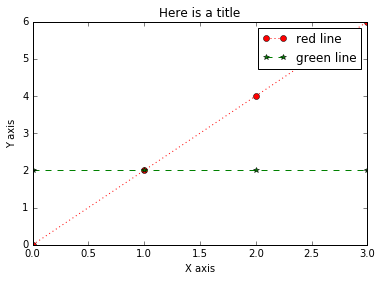

# Matplotlib's (pylab interface) basic commands for line plots

We run through the basic commands in matplotlib (pylab interface) for plotting lines.  
_Reference_ : [Python DataScience Handbook](https://jakevdp.github.io/PythonDataScienceHandbook/), Chapter 4, Simple line plots


```python
import matplotlib as mpl
import matplotlib.pyplot as plt
plt.style.use('classic')
import numpy as np

%matplotlib inline
```

# A simple plot

## Code


```python
fig_first=plt.figure()
plt.plot([1,2,3],[2,4,6])

```


    [<matplotlib.lines.Line2D at 0x10a2927d0>]


## Adding a semicolon


```python
fig_second=plt.figure()
#semicolon suppresses printing <matplotlib.lines.Line2D at 0x1148c7ed0>]
plt.plot([1,2,3],[2,4,6]);


```


# Subplots

## Plotting subplots


```python
fig_third=plt.figure()
#creates a 2 x 3 grid and in the first slot, will plot the following
plt.subplot(2,3,1)
plt.plot([1,2,3],[1,1,1])

#creates a 2 x 3 grid and in the third slot, will plot the following
plt.subplot(2,3,3)
plt.plot([1,2,3],[2,4,6])

#creates a 2 x 3 grid and in the fifth slot, will plot the following
plt.subplot(2,3,5)
plt.plot([1,2,3],[6,4,1]);
```


## Stateful: Current figure and axes


```python
fig_third=plt.figure()
#creates a 2 x 3 grid and in the first slot, will plot the following
plt.subplot(2,3,1)
plt.plot([1,2,3],[1,1,1])

#plt.gca() gets current axes, plt.gcf() gets current figure
print("First slot - ", end='')
print(f" current axes: {plt.gca()}")

#creates a 2 x 3 grid and in the third slot, will plot the following
plt.subplot(2,3,3)
plt.plot([1,2,3],[2,4,6])
print("Third slot = ", end='')
print(f" current axes: {plt.gca()}")

#creates a 2 x 3 grid and in the fifth slot, will plot the following
plt.subplot(2,3,5)
plt.plot([1,2,3],[6,4,1]);
print("Fifth slot - ", end='')
print(f" current axes: {plt.gca()}")
```

    First slot -  current axes: AxesSubplot(0.125,0.547727;0.227941x0.352273)
    Third slot =  current axes: AxesSubplot(0.672059,0.547727;0.227941x0.352273)
    Fifth slot -  current axes: AxesSubplot(0.398529,0.125;0.227941x0.352273)


# Multiple plots in a single image


```python
fig_fourth=plt.figure()
plt.plot([1,2,3],[1,2,3]);
plt.plot([1,2,3],[2,2,2]);
plt.plot([1,2,3],[3,2,1]);
plt.plot([2,2,2],[3,2,1]);


```


# Colours and line styles


```python
#Different styles of specifying color and line style

fig_fifth=plt.figure()
plt.subplot(2,3,1)
plt.plot([1,2,3,4],[1,1,1,1], color="green", linestyle="dashed", marker="*")

plt.subplot(2,3,3)
plt.plot([0,1,2,3],[0,2,4,6], color="r", linestyle=":", marker='o')

plt.subplot(2,3,4)
plt.plot([1,2,3],[6,4,1], color="cyan", linestyle="solid");


plt.subplot(2,3,6)
plt.plot([1,2,3],[10,8,6], "-.y");
```


## For more options


```python
help(plt.plot)
```

    Help on function plot in module matplotlib.pyplot:
    
    plot(*args, scalex=True, scaley=True, data=None, **kwargs)
        Plot y versus x as lines and/or markers.
        
        Call signatures::
        
            plot([x], y, [fmt], *, data=None, **kwargs)
            plot([x], y, [fmt], [x2], y2, [fmt2], ..., **kwargs)
        
        The coordinates of the points or line nodes are given by *x*, *y*.
        
        The optional parameter *fmt* is a convenient way for defining basic
        formatting like color, marker and linestyle. It's a shortcut string
        notation described in the *Notes* section below.
        
        >>> plot(x, y)        # plot x and y using default line style and color
        >>> plot(x, y, 'bo')  # plot x and y using blue circle markers
        >>> plot(y)           # plot y using x as index array 0..N-1
        >>> plot(y, 'r+')     # ditto, but with red plusses
        
        You can use `.Line2D` properties as keyword arguments for more
        control on the appearance. Line properties and *fmt* can be mixed.
        The following two calls yield identical results:
        
        >>> plot(x, y, 'go--', linewidth=2, markersize=12)
        >>> plot(x, y, color='green', marker='o', linestyle='dashed',
        ...      linewidth=2, markersize=12)
        
        When conflicting with *fmt*, keyword arguments take precedence.
        
        
        **Plotting labelled data**
        
        There's a convenient way for plotting objects with labelled data (i.e.
        data that can be accessed by index ``obj['y']``). Instead of giving
        the data in *x* and *y*, you can provide the object in the *data*
        parameter and just give the labels for *x* and *y*::
        
        >>> plot('xlabel', 'ylabel', data=obj)
        
        All indexable objects are supported. This could e.g. be a `dict`, a
        `pandas.DataFame` or a structured numpy array.
        
        
        **Plotting multiple sets of data**
        
        There are various ways to plot multiple sets of data.
        
        - The most straight forward way is just to call `plot` multiple times.
          Example:
        
          >>> plot(x1, y1, 'bo')
          >>> plot(x2, y2, 'go')
        
        - Alternatively, if your data is already a 2d array, you can pass it
          directly to *x*, *y*. A separate data set will be drawn for every
          column.
        
          Example: an array ``a`` where the first column represents the *x*
          values and the other columns are the *y* columns::
        
          >>> plot(a[0], a[1:])
        
        - The third way is to specify multiple sets of *[x]*, *y*, *[fmt]*
          groups::
        
          >>> plot(x1, y1, 'g^', x2, y2, 'g-')
        
          In this case, any additional keyword argument applies to all
          datasets. Also this syntax cannot be combined with the *data*
          parameter.
        
        By default, each line is assigned a different style specified by a
        'style cycle'. The *fmt* and line property parameters are only
        necessary if you want explicit deviations from these defaults.
        Alternatively, you can also change the style cycle using the
        'axes.prop_cycle' rcParam.
        
        
        Parameters
        ----------
        x, y : array-like or scalar
            The horizontal / vertical coordinates of the data points.
            *x* values are optional and default to `range(len(y))`.
        
            Commonly, these parameters are 1D arrays.
        
            They can also be scalars, or two-dimensional (in that case, the
            columns represent separate data sets).
        
            These arguments cannot be passed as keywords.
        
        fmt : str, optional
            A format string, e.g. 'ro' for red circles. See the *Notes*
            section for a full description of the format strings.
        
            Format strings are just an abbreviation for quickly setting
            basic line properties. All of these and more can also be
            controlled by keyword arguments.
        
            This argument cannot be passed as keyword.
        
        data : indexable object, optional
            An object with labelled data. If given, provide the label names to
            plot in *x* and *y*.
        
            .. note::
                Technically there's a slight ambiguity in calls where the
                second label is a valid *fmt*. `plot('n', 'o', data=obj)`
                could be `plt(x, y)` or `plt(y, fmt)`. In such cases,
                the former interpretation is chosen, but a warning is issued.
                You may suppress the warning by adding an empty format string
                `plot('n', 'o', '', data=obj)`.
        
        Other Parameters
        ----------------
        scalex, scaley : bool, optional, default: True
            These parameters determined if the view limits are adapted to
            the data limits. The values are passed on to `autoscale_view`.
        
        **kwargs : `.Line2D` properties, optional
            *kwargs* are used to specify properties like a line label (for
            auto legends), linewidth, antialiasing, marker face color.
            Example::
        
            >>> plot([1,2,3], [1,2,3], 'go-', label='line 1', linewidth=2)
            >>> plot([1,2,3], [1,4,9], 'rs',  label='line 2')
        
            If you make multiple lines with one plot command, the kwargs
            apply to all those lines.
        
            Here is a list of available `.Line2D` properties:
        
          agg_filter: a filter function, which takes a (m, n, 3) float array and a dpi value, and returns a (m, n, 3) array
          alpha: float
          animated: bool
          antialiased or aa: bool
          clip_box: `.Bbox`
          clip_on: bool
          clip_path: [(`~matplotlib.path.Path`, `.Transform`) | `.Patch` | None]
          color or c: color
          contains: callable
          dash_capstyle: {'butt', 'round', 'projecting'}
          dash_joinstyle: {'miter', 'round', 'bevel'}
          dashes: sequence of floats (on/off ink in points) or (None, None)
          drawstyle or ds: {'default', 'steps', 'steps-pre', 'steps-mid', 'steps-post'}, default: 'default'
          figure: `.Figure`
          fillstyle: {'full', 'left', 'right', 'bottom', 'top', 'none'}
          gid: str
          in_layout: bool
          label: object
          linestyle or ls: {'-', '--', '-.', ':', '', (offset, on-off-seq), ...}
          linewidth or lw: float
          marker: marker style
          markeredgecolor or mec: color
          markeredgewidth or mew: float
          markerfacecolor or mfc: color
          markerfacecoloralt or mfcalt: color
          markersize or ms: float
          markevery: None or int or (int, int) or slice or List[int] or float or (float, float)
          path_effects: `.AbstractPathEffect`
          picker: float or callable[[Artist, Event], Tuple[bool, dict]]
          pickradius: float
          rasterized: bool or None
          sketch_params: (scale: float, length: float, randomness: float)
          snap: bool or None
          solid_capstyle: {'butt', 'round', 'projecting'}
          solid_joinstyle: {'miter', 'round', 'bevel'}
          transform: `matplotlib.transforms.Transform`
          url: str
          visible: bool
          xdata: 1D array
          ydata: 1D array
          zorder: float
        
        Returns
        -------
        lines
            A list of `.Line2D` objects representing the plotted data.
        
        See Also
        --------
        scatter : XY scatter plot with markers of varying size and/or color (
            sometimes also called bubble chart).
        
        Notes
        -----
        **Format Strings**
        
        A format string consists of a part for color, marker and line::
        
            fmt = '[marker][line][color]'
        
        Each of them is optional. If not provided, the value from the style
        cycle is used. Exception: If ``line`` is given, but no ``marker``,
        the data will be a line without markers.
        
        Other combinations such as ``[color][marker][line]`` are also
        supported, but note that their parsing may be ambiguous.
        
        **Markers**
        
        =============    ===============================
        character        description
        =============    ===============================
        ``'.'``          point marker
        ``','``          pixel marker
        ``'o'``          circle marker
        ``'v'``          triangle_down marker
        ``'^'``          triangle_up marker
        ``'<'``          triangle_left marker
        ``'>'``          triangle_right marker
        ``'1'``          tri_down marker
        ``'2'``          tri_up marker
        ``'3'``          tri_left marker
        ``'4'``          tri_right marker
        ``'s'``          square marker
        ``'p'``          pentagon marker
        ``'*'``          star marker
        ``'h'``          hexagon1 marker
        ``'H'``          hexagon2 marker
        ``'+'``          plus marker
        ``'x'``          x marker
        ``'D'``          diamond marker
        ``'d'``          thin_diamond marker
        ``'|'``          vline marker
        ``'_'``          hline marker
        =============    ===============================
        
        **Line Styles**
        
        =============    ===============================
        character        description
        =============    ===============================
        ``'-'``          solid line style
        ``'--'``         dashed line style
        ``'-.'``         dash-dot line style
        ``':'``          dotted line style
        =============    ===============================
        
        Example format strings::
        
            'b'    # blue markers with default shape
            'or'   # red circles
            '-g'   # green solid line
            '--'   # dashed line with default color
            '^k:'  # black triangle_up markers connected by a dotted line
        
        **Colors**
        
        The supported color abbreviations are the single letter codes
        
        =============    ===============================
        character        color
        =============    ===============================
        ``'b'``          blue
        ``'g'``          green
        ``'r'``          red
        ``'c'``          cyan
        ``'m'``          magenta
        ``'y'``          yellow
        ``'k'``          black
        ``'w'``          white
        =============    ===============================
        
        and the ``'CN'`` colors that index into the default property cycle.
        
        If the color is the only part of the format string, you can
        additionally use any  `matplotlib.colors` spec, e.g. full names
        (``'green'``) or hex strings (``'#008000'``).
    


# Axes display

## Axes limits


```python
fig_sixth=plt.figure()
plt.subplot(2,1,1)
plt.plot([0,1,2,3],[0,2,4,6], color="r", linestyle=":", marker='o')

# Setting x limits from -5 to 5 and y limits from -10 to 10
plt.subplot(2,1,2)
plt.plot([0,1,2,3],[0,2,4,6], color="r", linestyle=":", marker='o')
plt.xlim(-5,5)
plt.ylim(-10,10);


#Introduces proper spacing between subplots
fig_sixth.tight_layout()


```


## Reversing axes


```python
fig_seventh = plt.figure()
plt.plot([0,1,2,3],[0,2,4,6], color="r", linestyle=":", marker='o')
plt.xlim(5,-5)
plt.ylim(-10,10);
```


## Using plt.axis()

### Instead of x_lim and y_lim


```python
fig_eighth = plt.figure()
plt.plot([0,1,2,3],[0,2,4,6], color="r", linestyle=":", marker='o');
#plt.axis([x_min, x_max, y_min, y_max])
plt.axis([-5,5,-10,10]);
```


### Making one unit of x = one unit of y


```python
fig_ninth = plt.figure()
plt.plot([0,1,2,3],[0,2,4,6], color="r", linestyle=":", marker='o');
plt.axis('equal');
```


### Tighten bounds on plot


```python
fig_tenth = plt.figure()
plt.plot([0,1,2,3],[0,2,4,6], color="r", linestyle=":", marker='o')
plt.axis('tight');
```


### For more options


```python
help(plt.axis)
```

    Help on function axis in module matplotlib.pyplot:
    
    axis(*args, **kwargs)
        Convenience method to get or set some axis properties.
        
        Call signatures::
        
          xmin, xmax, ymin, ymax = axis()
          xmin, xmax, ymin, ymax = axis([xmin, xmax, ymin, ymax])
          xmin, xmax, ymin, ymax = axis(option)
          xmin, xmax, ymin, ymax = axis(**kwargs)
        
        Parameters
        ----------
        xmin, xmax, ymin, ymax : float, optional
            The axis limits to be set. Either none or all of the limits must
            be given. This can also be achieved using ::
        
                ax.set(xlim=(xmin, xmax), ylim=(ymin, ymax))
        
        option : bool or str
            If a bool, turns axis lines and labels on or off. If a string,
            possible values are:
        
            ======== ==========================================================
            Value    Description
            ======== ==========================================================
            'on'     Turn on axis lines and labels. Same as ``True``.
            'off'    Turn off axis lines and labels. Same as ``False``.
            'equal'  Set equal scaling (i.e., make circles circular) by
                     changing axis limits.
            'scaled' Set equal scaling (i.e., make circles circular) by
                     changing dimensions of the plot box.
            'tight'  Set limits just large enough to show all data.
            'auto'   Automatic scaling (fill plot box with data).
            'normal' Same as 'auto'; deprecated.
            'image'  'scaled' with axis limits equal to data limits.
            'square' Square plot; similar to 'scaled', but initially forcing
                     ``xmax-xmin = ymax-ymin``.
            ======== ==========================================================
        
        emit : bool, optional, default *True*
            Whether observers are notified of the axis limit change.
            This option is passed on to `~.Axes.set_xlim` and
            `~.Axes.set_ylim`.
        
        Returns
        -------
        xmin, xmax, ymin, ymax : float
            The axis limits.
        
        See also
        --------
        matplotlib.axes.Axes.set_xlim
        matplotlib.axes.Axes.set_ylim
    


# Labels

## Labelling a single graph


```python
fig_eleventh = plt.figure()
plt.plot([0,1,2,3],[0,2,4,6], color="r", linestyle=":", marker='o')
plt.axis([-5,5,-8,8])
plt.title("Here is a title")
plt.xlabel("X axis")
plt.ylabel("Y axis");
```


## Turn off x, y axes


```python
fig_twelfth = plt.figure()
plt.plot([0,1,2,3],[0,2,4,6], color="r", linestyle=":", marker='o')
plt.axis([-5,5,-8,8])
plt.title("Here is a title")
plt.xlabel("X axis")
plt.ylabel("Y axis")
plt.axis(False);
```


## Labelling multiple graphs


```python
fig_thirteenth = plt.figure()
plt.plot([0,1,2,3],[0,2,4,6], color="r", linestyle=":", marker='o', label="red line")
plt.plot([0,1,2,3],[2,2,2,2], color="g", linestyle="--", marker='*', label="green line")
plt.title("Here is a title")
plt.xlabel("X axis")
plt.ylabel("Y axis")
plt.legend();
```





## Fancier options


```python
fig_fourteenth=plt.figure()
plt.plot([0,1,2,3],[0,2,4,6], color="r", linestyle=":", marker='o', label="red line")
plt.plot([0,1,2,3],[2,2,2,2], color="g", linestyle="--", marker='*', label="green line")
plt.title("Here is a title")
plt.xlabel("X axis")
plt.ylabel("Y axis")
plt.legend(fancybox=True, shadow=True)
fig_fourteenth.tight_layout();
```


## Labelling subplots 


```python
fig_fourteenth=plt.figure()
#creates a 2 x 3 grid and in the first slot, will plot the following
plt.subplot(2,3,1)
plt.plot([1,2,3],[1,1,1], color="r", linestyle=":", marker='o', label="red line")
plt.legend(loc='upper center', bbox_to_anchor=(0.5, 1.05),
          ncol=3, fancybox=True, shadow=True)

#creates a 2 x 3 grid and in the third slot, will plot the following
plt.subplot(2,3,3)
plt.plot([1,2,3],[2,4,6], color="g", linestyle="--", marker='*', label="green line")
plt.legend(loc='upper center', bbox_to_anchor=(0.5, 1.05),
          ncol=3, fancybox=True, shadow=True)

#creates a 2 x 3 grid and in the fifth slot, will plot the following
plt.subplot(2,3,5)
plt.plot([1,2,3],[6,4,1], color="b", linestyle="-", marker='^', label="blue line")
plt.legend(loc='upper center', bbox_to_anchor=(0.5, 1.05),
          ncol=3, fancybox=True, shadow=True);
```


```python

```
