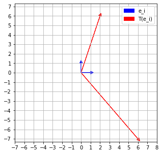
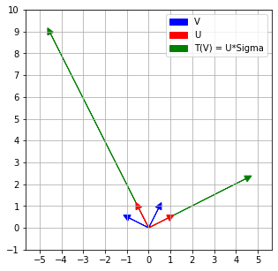

# Plotting simple vectors using matplotlib arrows


```python
import matplotlib.pyplot as plt
import numpy as np
%matplotlib inline

```

The command to plot an arrow is  

<pre>ax.arrow(x,y, dx, dy, fc = colour_of_arrow_head, ec = colour_of_arrow, head_width, head_length, label)</pre>


It plots an arrow, joining (x,y) and (x+dx, y+dy) with the head of the arrow at (x+dx, y+dy). For the label to be shown in the legend, remember to say ax.legend(handles = [label_names])


```python
fig, ax = plt.subplots(figsize=(5, 5))
#Enables grid
ax.grid(True)
ax.axis('equal')
ax.set_xlim(-7,8);
ax.set_ylim(-8,8);
#Forces grid lines to be drawn after every unit length
ax.xaxis.set_major_locator(plt.MultipleLocator(1))
ax.yaxis.set_major_locator(plt.MultipleLocator(1))


blue_arrows = ax.arrow( 0, 0, 1, 0, fc="blue", ec="blue",head_width=0.3, head_length=0.3, label = "e_i")
blue_arrows = ax.arrow( 0, 0, 0, 1, fc="blue", ec="blue",head_width=0.3, head_length=0.3, label = "e_i")
red_arrows = ax.arrow( 0, 0, 6, -7, fc="red", ec="red",head_width=0.3, head_length=0.3, label = "T(e_i")
red_arrows = ax.arrow( 0, 0, 2, 6, fc="red", ec="red",head_width=0.3, head_length=0.3, label = "T(e_i)")

ax.legend(handles=[blue_arrows, red_arrows])
plt.show()
#fig.savefig('action_on_coordinate_axes.png')

```





```python
fig, ax = plt.subplots(figsize=(5, 5))
ax.grid(True)
ax.axis('equal')
ax.set_xlim(-10, 10);
ax.set_ylim(-1,10);
ax.xaxis.set_major_locator(plt.MultipleLocator(1))
ax.yaxis.set_major_locator(plt.MultipleLocator(1))


blue_arrows = ax.arrow( 0, 0, -0.89, 0.45, fc="blue", ec="blue",head_width=0.3, head_length=0.3, label = "V")
blue_arrows = ax.arrow( 0, 0, 0.45, 0.89, fc="blue", ec="blue",head_width=0.3, head_length=0.3, label = "V")
green_arrows = ax.arrow( 0, 0, -0.45*10,0.89*10, fc="green", ec="green",head_width=0.3, head_length=0.3, label = "T(V) = U*Sigma")
green_arrows = ax.arrow( 0, 0, 0.89*5, 0.45*5, fc="green", ec="green",head_width=0.3, head_length=0.3, label = "T(V) = U*Sigma")
red_arrows = ax.arrow( 0, 0, -0.45, 0.89, fc="red", ec="red",head_width=0.3, head_length=0.3, label = "U")
red_arrows = ax.arrow( 0, 0, 0.89, 0.45, fc="red", ec="red",head_width=0.3, head_length=0.3, label = "U")

ax.legend(handles=[blue_arrows, red_arrows, green_arrows])
fig.savefig('SVD.png')


```





```python

```
