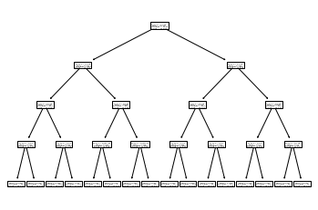
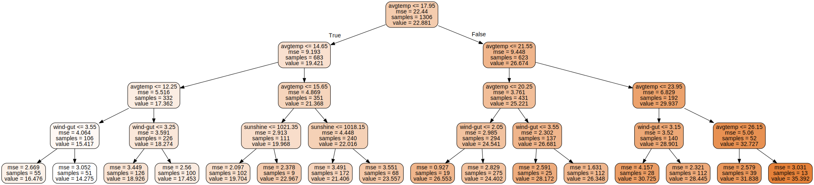
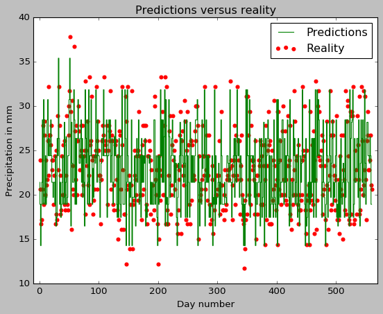

# Decision tree regressor using scikit-learn


```python
#imports
import pandas as pd
import matplotlib.pyplot as plt
plt.style.use('classic')
import numpy as np

from sklearn.model_selection import train_test_split
from sklearn.tree import DecisionTreeRegressor
from sklearn import tree
from sklearn.tree import export_graphviz
import graphviz 
from sklearn.metrics import mean_squared_error
```

# Weather data


```python
col_names = ['date','avgtemp', 'mintemp', 'pp', 'snow', 'wind-dir', 'wind-speed', 'wind-gut', 'air-pressure', 'sunshine', 'dummy']
#Reads the comma separated csv into a pandas dataframe
daily_weather_df =pd.read_csv('KCQT0.csv', sep=',',names=col_names, header = None)

```


```python
print("Weather dataframe looks like:")
daily_weather_df.head()
```

    Weather dataframe looks like:


<div>
<table border="1" class="dataframe">
  <thead>
    <tr style="text-align: right;">
      <th></th>
      <th>date</th>
      <th>avgtemp</th>
      <th>mintemp</th>
      <th>pp</th>
      <th>snow</th>
      <th>wind-dir</th>
      <th>wind-speed</th>
      <th>wind-gut</th>
      <th>air-pressure</th>
      <th>sunshine</th>
      <th>dummy</th>
    </tr>
  </thead>
  <tbody>
    <tr>
      <th>0</th>
      <td>2000-01-01</td>
      <td>10.4</td>
      <td>7.8</td>
      <td>13.9</td>
      <td>NaN</td>
      <td>NaN</td>
      <td>NaN</td>
      <td>2.0</td>
      <td>NaN</td>
      <td>1018.9</td>
      <td>NaN</td>
    </tr>
    <tr>
      <th>1</th>
      <td>2000-01-02</td>
      <td>12.0</td>
      <td>7.2</td>
      <td>15.6</td>
      <td>NaN</td>
      <td>NaN</td>
      <td>NaN</td>
      <td>8.1</td>
      <td>NaN</td>
      <td>1021.0</td>
      <td>NaN</td>
    </tr>
    <tr>
      <th>2</th>
      <td>2000-01-03</td>
      <td>11.4</td>
      <td>5.6</td>
      <td>18.9</td>
      <td>NaN</td>
      <td>NaN</td>
      <td>NaN</td>
      <td>1.3</td>
      <td>NaN</td>
      <td>1026.5</td>
      <td>NaN</td>
    </tr>
    <tr>
      <th>3</th>
      <td>2000-01-04</td>
      <td>12.6</td>
      <td>7.2</td>
      <td>20.0</td>
      <td>NaN</td>
      <td>NaN</td>
      <td>NaN</td>
      <td>3.0</td>
      <td>NaN</td>
      <td>1024.9</td>
      <td>NaN</td>
    </tr>
    <tr>
      <th>4</th>
      <td>2000-01-05</td>
      <td>13.3</td>
      <td>5.6</td>
      <td>21.7</td>
      <td>NaN</td>
      <td>NaN</td>
      <td>NaN</td>
      <td>1.9</td>
      <td>NaN</td>
      <td>1018.0</td>
      <td>NaN</td>
    </tr>
  </tbody>
</table>
</div>


```python
#Delete irrelevant cols
del daily_weather_df['dummy']
del daily_weather_df['air-pressure']
del daily_weather_df['wind-speed']
del daily_weather_df['snow']
del daily_weather_df['wind-dir']
del daily_weather_df['date']
del daily_weather_df['mintemp']
```


```python
print("Weather dataframe now looks like:")
daily_weather_df.head()
```

    Weather dataframe now looks like:


<div>
<table border="1" class="dataframe">
  <thead>
    <tr style="text-align: right;">
      <th></th>
      <th>avgtemp</th>
      <th>pp</th>
      <th>wind-gut</th>
      <th>sunshine</th>
    </tr>
  </thead>
  <tbody>
    <tr>
      <th>0</th>
      <td>10.4</td>
      <td>13.9</td>
      <td>2.0</td>
      <td>1018.9</td>
    </tr>
    <tr>
      <th>1</th>
      <td>12.0</td>
      <td>15.6</td>
      <td>8.1</td>
      <td>1021.0</td>
    </tr>
    <tr>
      <th>2</th>
      <td>11.4</td>
      <td>18.9</td>
      <td>1.3</td>
      <td>1026.5</td>
    </tr>
    <tr>
      <th>3</th>
      <td>12.6</td>
      <td>20.0</td>
      <td>3.0</td>
      <td>1024.9</td>
    </tr>
    <tr>
      <th>4</th>
      <td>13.3</td>
      <td>21.7</td>
      <td>1.9</td>
      <td>1018.0</td>
    </tr>
  </tbody>
</table>
</div>


```python
daily_weather_df.shape
```


    (2174, 4)


```python
#Check how many NaN entries in each column
daily_weather_df.isnull().sum()
```


    avgtemp      10
    pp           10
    wind-gut    224
    sunshine    233
    dtype: int64


```python
#Delete rows with NaN entries
daily_weather_df.dropna(inplace=True)

```


```python
daily_weather_df.shape
```


    (1866, 4)


# Regression task

Let's predict precipitation given avg-temp, min-temp, wind-gut and sunshine. We'll do that by doing regression using Decision Trees


```python
#Drop precipitation column to get weather_features
weather_features = daily_weather_df.drop(['pp'], axis=1)
```


```python
weather_features.head()
```


<div>

<table border="1" class="dataframe">
  <thead>
    <tr style="text-align: right;">
      <th></th>
      <th>avgtemp</th>
      <th>wind-gut</th>
      <th>sunshine</th>
    </tr>
  </thead>
  <tbody>
    <tr>
      <th>0</th>
      <td>10.4</td>
      <td>2.0</td>
      <td>1018.9</td>
    </tr>
    <tr>
      <th>1</th>
      <td>12.0</td>
      <td>8.1</td>
      <td>1021.0</td>
    </tr>
    <tr>
      <th>2</th>
      <td>11.4</td>
      <td>1.3</td>
      <td>1026.5</td>
    </tr>
    <tr>
      <th>3</th>
      <td>12.6</td>
      <td>3.0</td>
      <td>1024.9</td>
    </tr>
    <tr>
      <th>4</th>
      <td>13.3</td>
      <td>1.9</td>
      <td>1018.0</td>
    </tr>
  </tbody>
</table>
</div>


```python
precipitation_labels = daily_weather_df['pp']
```


```python
 precipitation_labels.head()
```


    0    13.9
    1    15.6
    2    18.9
    3    20.0
    4    21.7
    Name: pp, dtype: float64


# Training and test data split


```python
#Declare random state to be an int to get reproducible output, shuffle is True by default
X_train, X_test, y_train, y_test = train_test_split(weather_features, precipitation_labels,
                                                    test_size=0.30, random_state=10, shuffle=True)
```


```python
print(f"Training data : {X_train.shape}, {y_train.shape}")
print(f"Test data : {X_test.shape}, {y_test.shape}")
```

    Training data : (1306, 3), (1306,)
    Test data : (560, 3), (560,)


# Regression Tree


```python
tree_reg = DecisionTreeRegressor(max_depth=4)
tree_reg.fit(X_train, y_train)
```


    DecisionTreeRegressor(ccp_alpha=0.0, criterion='mse', max_depth=4,
                          max_features=None, max_leaf_nodes=None,
                          min_impurity_decrease=0.0, min_impurity_split=None,
                          min_samples_leaf=1, min_samples_split=2,
                          min_weight_fraction_leaf=0.0, presort='deprecated',
                          random_state=None, splitter='best')


```python
tree.plot_tree(tree_reg) 
```


    [Text(167.4, 195.696, 'X[0] <= 17.95\nmse = 22.44\nsamples = 1306\nvalue = 22.881'),
     Text(83.7, 152.208, 'X[0] <= 14.65\nmse = 9.193\nsamples = 683\nvalue = 19.421'),
     Text(41.85, 108.72, 'X[0] <= 12.25\nmse = 5.516\nsamples = 332\nvalue = 17.362'),
     Text(20.925, 65.232, 'X[1] <= 3.55\nmse = 4.064\nsamples = 106\nvalue = 15.417'),
     Text(10.4625, 21.744, 'mse = 2.669\nsamples = 55\nvalue = 16.476'),
     Text(31.387500000000003, 21.744, 'mse = 3.052\nsamples = 51\nvalue = 14.275'),
     Text(62.775000000000006, 65.232, 'X[1] <= 3.25\nmse = 3.591\nsamples = 226\nvalue = 18.274'),
     Text(52.3125, 21.744, 'mse = 3.449\nsamples = 126\nvalue = 18.926'),
     Text(73.2375, 21.744, 'mse = 2.56\nsamples = 100\nvalue = 17.453'),
     Text(125.55000000000001, 108.72, 'X[0] <= 15.65\nmse = 4.869\nsamples = 351\nvalue = 21.368'),
     Text(104.625, 65.232, 'X[2] <= 1021.35\nmse = 2.913\nsamples = 111\nvalue = 19.968'),
     Text(94.16250000000001, 21.744, 'mse = 2.097\nsamples = 102\nvalue = 19.704'),
     Text(115.0875, 21.744, 'mse = 2.378\nsamples = 9\nvalue = 22.967'),
     Text(146.475, 65.232, 'X[2] <= 1018.15\nmse = 4.448\nsamples = 240\nvalue = 22.016'),
     Text(136.01250000000002, 21.744, 'mse = 3.491\nsamples = 172\nvalue = 21.406'),
     Text(156.9375, 21.744, 'mse = 3.551\nsamples = 68\nvalue = 23.557'),
     Text(251.10000000000002, 152.208, 'X[0] <= 21.55\nmse = 9.448\nsamples = 623\nvalue = 26.674'),
     Text(209.25, 108.72, 'X[0] <= 20.25\nmse = 3.761\nsamples = 431\nvalue = 25.221'),
     Text(188.32500000000002, 65.232, 'X[1] <= 2.05\nmse = 2.985\nsamples = 294\nvalue = 24.541'),
     Text(177.8625, 21.744, 'mse = 0.927\nsamples = 19\nvalue = 26.553'),
     Text(198.7875, 21.744, 'mse = 2.829\nsamples = 275\nvalue = 24.402'),
     Text(230.175, 65.232, 'X[1] <= 3.55\nmse = 2.302\nsamples = 137\nvalue = 26.681'),
     Text(219.7125, 21.744, 'mse = 2.591\nsamples = 25\nvalue = 28.172'),
     Text(240.63750000000002, 21.744, 'mse = 1.631\nsamples = 112\nvalue = 26.348'),
     Text(292.95, 108.72, 'X[0] <= 23.95\nmse = 6.829\nsamples = 192\nvalue = 29.937'),
     Text(272.02500000000003, 65.232, 'X[1] <= 3.15\nmse = 3.52\nsamples = 140\nvalue = 28.901'),
     Text(261.5625, 21.744, 'mse = 4.157\nsamples = 28\nvalue = 30.725'),
     Text(282.4875, 21.744, 'mse = 2.321\nsamples = 112\nvalue = 28.445'),
     Text(313.875, 65.232, 'X[0] <= 26.15\nmse = 5.06\nsamples = 52\nvalue = 32.727'),
     Text(303.4125, 21.744, 'mse = 2.579\nsamples = 39\nvalue = 31.838'),
     Text(324.33750000000003, 21.744, 'mse = 3.031\nsamples = 13\nvalue = 35.392')]





# Prettier visuals


```python
dot_data = export_graphviz(
            tree_reg,
            out_file=None,
            feature_names=weather_features.columns,
            rounded=True,
            filled=True
        )
    
    
prettier_graph = graphviz.Source(dot_data)  
prettier_graph

```





# Saving decision tree visualizations to an image file


```python

```

# Predictions

## Individual data point predictions


```python
X_test.head()
```


<div>

<table border="1" class="dataframe">
  <thead>
    <tr style="text-align: right;">
      <th></th>
      <th>avgtemp</th>
      <th>wind-gut</th>
      <th>sunshine</th>
    </tr>
  </thead>
  <tbody>
    <tr>
      <th>646</th>
      <td>17.3</td>
      <td>2.9</td>
      <td>1015.1</td>
    </tr>
    <tr>
      <th>36</th>
      <td>14.6</td>
      <td>2.3</td>
      <td>1022.2</td>
    </tr>
    <tr>
      <th>68</th>
      <td>12.0</td>
      <td>4.4</td>
      <td>1023.5</td>
    </tr>
    <tr>
      <th>716</th>
      <td>13.7</td>
      <td>2.0</td>
      <td>1018.1</td>
    </tr>
    <tr>
      <th>843</th>
      <td>16.2</td>
      <td>5.1</td>
      <td>1014.4</td>
    </tr>
  </tbody>
</table>
</div>


```python
y_test.head()
```


    646    20.6
    36     23.9
    68     16.7
    716    17.2
    843    20.6
    Name: pp, dtype: float64


```python
x_sample_point = X_test.loc[646]
y_sample_point = y_test.loc[646]
print(x_sample_point)
```

    avgtemp       17.3
    wind-gut       2.9
    sunshine    1015.1
    Name: 646, dtype: float64


```python
print(f"True precipitation is : {y_sample_point}")
print(f"Prediction precipitation is  {tree_reg.predict([x_sample_point])}")
```

    True precipitation is : 20.6
    Prediction precipitation is  [21.40639535]


## Test set predictions


```python
y_pred = tree_reg.predict(X_test)
```


```python
type(y_pred), y_pred.shape
```


    (numpy.ndarray, (560,))


```python
y_pred[:10]
```


    array([21.40639535, 18.92619048, 14.2745098 , 18.92619048, 21.40639535,
           28.44464286, 18.92619048, 30.725     , 28.44464286, 18.92619048])


# Evaluation of predictions


```python
y_test_numpy = y_test.to_numpy()
```


```python
#Root mean squared error between predictions and test values
mean_squared_error(y_test_numpy,y_pred,squared=False)
```


    1.7764921365123483


```python
#Plot of y_test and y_pred
```


```python
evaluation_of_predictions =plt.figure()
plt.scatter(range(1,561),y_test, color="red", label="Reality");
plt.step(range(1,561),y_pred, color="green",label="Predictions");
plt.xlim(-10,570)
plt.title("Predictions versus reality")
plt.xlabel("Day number")
plt.ylabel("Precipitation in mm");
plt.legend();
```





```python

```
